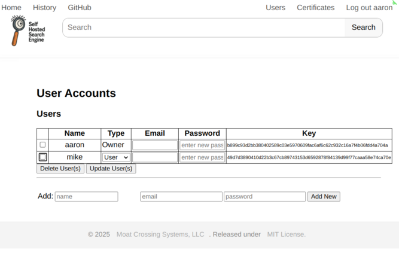
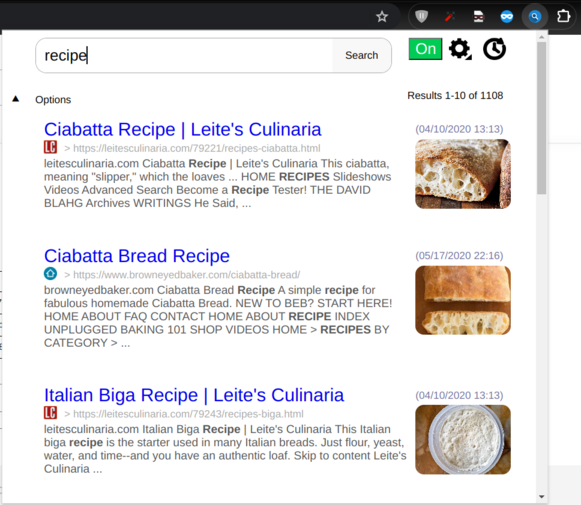
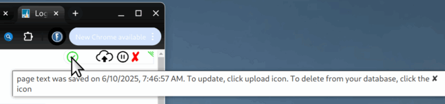

# Self_Hosted_Search_Engine
Browser extension and server saves visited pages to a personal search engine

# Extension
We have not yet published to safari stores. Chrome web store is pending.  Official Firefox extension is now available [here](https://addons.mozilla.org/en-US/firefox/addon/self-hosted-search-engine/).

For now, to use in Chrome, you will need to enable developer tools and use the [/extension/](extension/) directory in this repo to load the extension. We will update when the extension is on the chrome web store.

# Server

## Direct Use:
The server requires [rampart](https://rampart.dev/) to be installed.  Clone this repo and run the *shse-server.sh* command to start the server.
More configuration can be found in the [web_server/web_server_conf.js](web_server/web_server_conf.js) file.

If you plan to run it behind, e.g., nginx reverse proxy (with its own valid certificates), you can start the server in httpOnly mode
```
./shse-server.sh httpOnly
```
In this mode, it will be available on port **8070** (or the ``httpOnlyPort`` specified in [the web_server_conf.js](web_server/web_server_conf.js) file).

## Docker Command Line:

You will likely want your data to persist in order to later pull the latest shse image without losing your data, so here is a suggested use:
```
mkdir ~/.shse-data
docker run -d -p 4443:443 -v ~/.shse-data:/data rampartfts/shse
```
The server must run as a secure server in order to view the webpage and for the browser plugin to work.  When the server starts the first time, it will create its own self signed certificate.
This will require you to go to, e.g., ``https://localhost:4443/`` and "accept the risks".

There is a certificate management page should you wish to upload valid certificates (see below).

If you plan to run it behind, e.g., nginx reverse proxy (with its own valid certificates), you can start the server in httpOnly mode:
```
docker run -d -p 8080:80 -v ~/.shse-data:/data rampartfts/shse httpOnly
```
In this mode, it will be available on port **8080** (or the port specified with the above ``-v`` option).

## Docker Desktop:

First find the shse image and pull:


Find it in the images tab and click run:


Add options for ports and to mount the ``/data`` directory, then run it.


## Docker Caveats
__Do not__ run more than one docker using the same ``/data`` volume host path, or corruption will likely occur (database locking happens inside each container and is not shared between containers).

# Setup

## Server
After starting the server and navigating to, e.g. ``https://localhost:4443/``, you will be asked to enter a user name and passwords.  This
will be the "Owner's" account, which has and can confer admin privileges to other users.

From there, as the Owner (or as an admin) you will be able to add users and upload certificates.

__Users Page:__



* note email is saved, but not used at this time.

__Certificates Page:__


## Plugin
After installing the plugin for the browser (*and pinning it to the toolbar*), click on the popup magnifying glass in the browser toolbar and in the popup, click on
the gear icon.


Enter the relevant information, click retrieve key and save.
There will be two groups of urls that are by default blacklisted:  Banks (such as citibank, wellsfargo, chase, etc), and Portals (such as google, yahoo, bing, chatgpt, etc).  When you add the server address, it will be added to the blacklist as well.  Any or all of these can be removed, and more added to suit your needs.

You can find the list of ``--banks`` and ``--portals`` at the top of the source code in the [extension/js/shseContentScript.js file](https://github.com/aflin/Self_Hosted_Search_Engine/blob/main/extension/js/shseContentScript.js)

Note also the option to index individual facebook and bsky posts, and the option to grab youtube captions.  These are unchecked by default.  Be aware that indexing individual bsky/facebook posts can result in a disproportionately large amount of those pages in the index, but should not otherwise affect the quality of search results.

Once you start browsing, pages will automatically be saved to the server's database.  When you wish to find a page you've already visited, you can use either the server's page or the pupup to search.  Clicking on "options" will allow you to delete individual or groups of pages from the search engine.



By clicking on the history icon (or visiting the History page on the server), you can also examine your browsing history on any given day, ordered by date or grouped by site.  You can also search for a domain and get a listing of dates when you visited that domain in the current 3 month time span displayed (as shown below).


## In Tabs

When the extension is active (button next to the gear button says "ON" and is green), every page in every tab will have a small "infobox" control bar at the top-right.
It can be collapsed to minimize its presense on the page.



If you do not wish to index every page, you can click the pause button in the control bar to enter *manual mode*.  When in *manual mode*, pages are not automatically saved to the server, but can be individually indexed by clicking the upload button in the control bar.

# License Caveats

Note that although this project is permissively licensed, as is [rampart](https://rampart.dev/), the sql search engine is under a [different license](https://github.com/aflin/rampart/blob/main/LICENSE-rsal.txt).  For most DIYers, this should not restrict your use in any way.  If you want to sell this as a service or product, you must contact us.

Enjoy!
